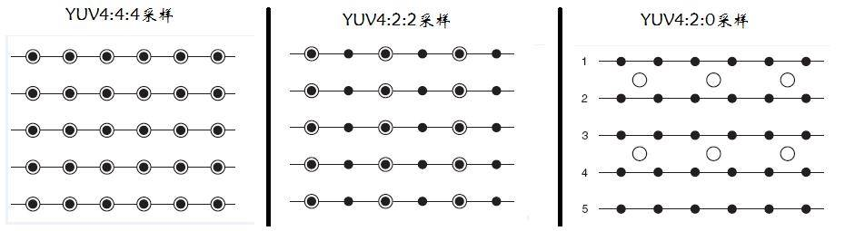

* 分辨率：
	* 显示（屏幕）分辨率：是指显示器所能显示的像素有多少  
	* 图像分辨率： 单位英寸所包含的像素点数
* 像素：
* 色彩空间：
	* RGB： 
		* **rgb32**对应格式为rgba,每个分量占8位,共32位
		* **rgb24**对应格式为rgb,每个分量占8位,共24位
		* **rgb16**对应格式为rgb,或rgba,每个分量占位数有多种情况,常用的有565\5551,共16位 
		* RGB32到RGB16/RGB24的转换
			rgb32->rgb24,每个像素只取低24位就可以
			rgb32->rgb16,取低24位,再根据16位格式对各rgb分量取高位,例如565格式取bit23~19,bit15~10,bit7~3拼成rgb16 
	* YUV：Y表示明亮度（Luma）也就是灰度值,U和V表示色度，作用是描述影像色彩饱和度，用于指定像素的颜色
		* YUV 格式
		用三个图来直观地表示采样的方式，以黑点表示采样该像素点的Y分量，以空心圆圈表示采用该像素点的UV分量	 
		

		|YUV格式|说明|每个像素位数|
		|-|-|-|
		|YUV 4:4:4|YUV完全采样。每一组Y对应一组UV分量|24位（8+8+8）|
		|YUV 4:2:2|2:1的水平采样。每两个Y共用一组UV分量|16位（8+4+4）|
		|YUV 4:2:0|2:1的水平取样，垂直2:1采样。每4个Y共用一组UV分量|12位（8+2+2）|
		
		* YUV420
			YUV420视频图像打包格式：planer和packed两种方式
			planer的YUV格式，先连续存储所有像素点的Y,紧接着存储所有像素点的U，随后是V
			packed：像素点的Y，U，V是连续交错存储的
		* **YUV420与YUV420p的区别**
			区别是在数据存储方式上，后缀P表示的是planar方式存储。例如：
		> yuv420p：yyyyyyyy uuuuuuuu vvvvv
			yuv420： yuv yuv yuv
* 视频帧：
	视频，是由一系列连续的静态影像（图像）组成。视频的每幅静态影像（图像），称作视频帧。
 
* 帧率： 
	视频帧率，指视频每秒呈现的视频帧数。
* Alpha通道：
	控制图像透明度
	* Alpha值， 是色彩空间RGB/YUV的额外信息，不表示任何色彩。记录的是一个比例值，表示像素点对于图像的像素比例。0表示无该像素点无贡献，透明；255，该像素点的贡献为100%，不透明。
	  

 