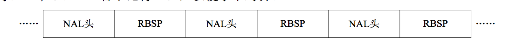
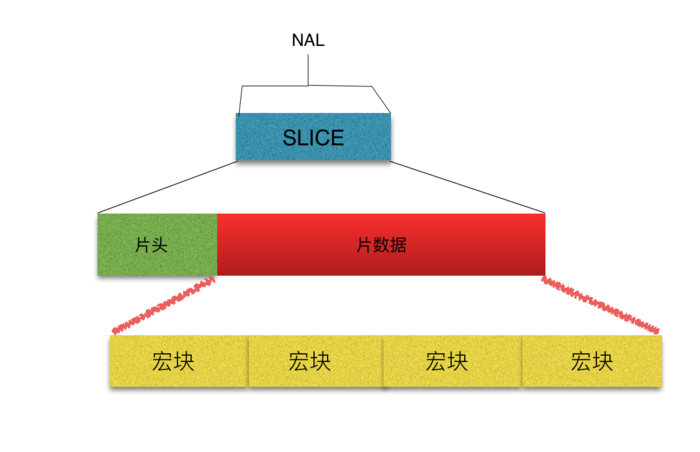
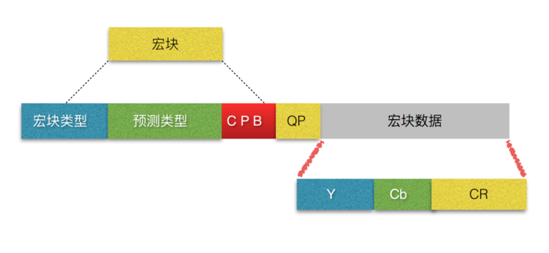
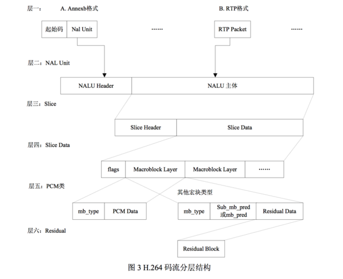
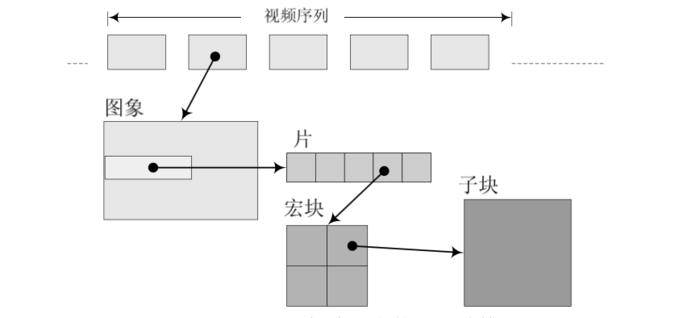
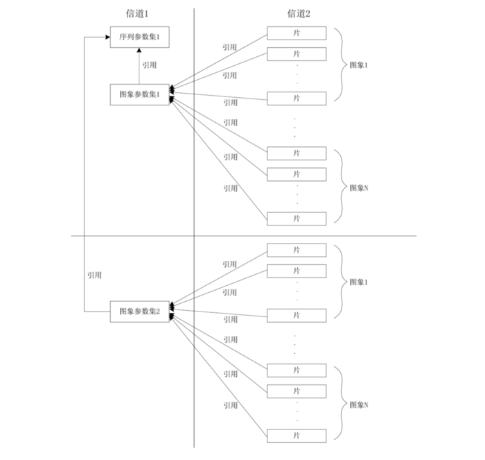
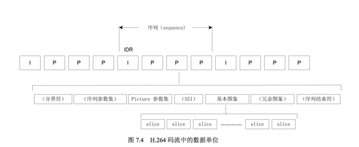

* H.264 原始码流(又称为裸流)，是有一个接一个的 NALU 组成的，而它的功能分为两层:视频编码层(VCL, Video Coding Layer)和网络提取层(NAL, Network Abstraction Layer)。
	* VCL数据即编码处理的输出，它表示被压缩编码后视频数据序列。
	在VCL数据传输或存储之前，这些编码的VCL数据，先被映射或封装进NAL单元（NALU， Nal unit）
	* 每个NALU包括一个原始字节序列负荷（RBSP， raw byte sequence payload）、一组对应于视频编码的NALU头部信息。
	* RBSP基本结构是：在原始编码数据的后面添加了结尾比特，一个bit'1'若干bit'0'，以便字节对齐。
	**NAL单元排列**
	
* 切片： 主要的作用是用作宏块的载体。目的是为了限制错误码的扩散和传输。
	* 如何限制错误码的扩散和传输
		* 每个切片都应该是互相独立被传输的，某片的预测（片内预测、片间预测），不能以其他片中的宏块为参考图像。
		**slice结构图**
		
		* 片头中的数据： **分片类型、分片中的宏块类型、分片帧的数量、分片属于哪个图像以及对应的帧的设置和参数等信息**
		* 分片数据中则是宏块，就是存储像素数据的地方
* 宏块： 是视频信息的主要承载者，它包含着每一个像素的亮度和色度信息。
	视频解码最主要的工作是提供高效的方式，从码流中获得宏块中的像素阵列。
	* 组成部分： 一个宏块由一个16*16亮度像素和附加的一个8*8的Cb和一个8*8Cr彩色像素块组成。每个图像中，若干宏块被排列成片的形式。
		**宏块结构图**  
	 
	从上图中，可以看到，宏块中包含了宏块类型、预测类型、Coded Block Pattern、Quantization Parameter、像素的亮度和色度数据集等等信息。
* 切片类型与宏块类型的关系
	* 对于切片类型来讲分为以下几种类型：
		> 0 **P-slice**. Consists of P-macroblocks (each macro block is predicted using one reference frame) and / or I-macroblocks.
		1 **B-slice**. Consists of B-macroblocks (each macroblock is predicted using one or two reference frames) and / or I-macroblocks.
		2 **I-slice**. Contains only I-macroblocks. Each macroblock is predicted from previously coded blocks of the same slice.
		3 **SP-slice**. Consists of P and / or I-macroblocks and lets you switch between encoded streams.
		4 **SI-slice**. It consists of a special type of SI-macroblocks and lets you switch between encoded streams.

	* I片：
		只包I宏块，I宏块利用从当前片中已解码的像素作为参考进行帧内预测（不能去其他片中的已解码像素作为参考进行帧内预测）
	* P片：
		可包P和I宏块，P宏块利用前面已编码图像作为参考图像进行帧内预测，一个帧内编码的宏块可进一步做宏块的分割：即16×16、16×8、8×16 或 8×8亮度像素块（以及附带的彩色像素）；如果选择了8x8的子宏块，则可再分成各种子宏块的分割，其尺寸为8×8、8×4、4×8 或 4×4 亮度像素块(以及附带的彩色像素)
	* B片：
		可包B和I宏块，B宏块则利用双向的参考图像（当前和将来的已编码图像帧），进行帧内预测
	* SP片：
		用于不同编码 流之间的切换，包含P和或I宏块
	* SI片：
		扩展档次中必须具有的切换，它包含了一种特殊类型的编码宏块，叫做SI宏块，SI也是扩展档次中的必备功能
* 整体结构
	**H.264码流分层结构**
	  
	* 视频编码后的每一组图像（GOP），都给予了传输中 的序列（PPS）和本身这个帧的图像参数（SPS）。
	**整体结构**
	 

* GOP
* PPS（Sequence Parameter Sets） 
	包括一个图像序列的所有信息，即两个 IDR 图像间的所有图像信息，如图像尺寸、视频格式等 
	[参考链接](https://zhuanlan.zhihu.com/p/27896239) 

* SPS （Picture Parameter Set ）
	包括一个图像的所有分片的所有相关信息， 包括图像类型、序列号等，解码时某些序列号的丢失可用来检验信息包的丢失与否
	[参考链接](https://zhuanlan.zhihu.com/p/27896239)
* 帧内预测编码： 在同一帧中相邻像素之间有很大的相关性，两像素越近则相关性越大
* 帧间预测编码： 在一组视频序列中，相邻两帧只有极少的不同之处
* DTS ： 解码时间戳，用于排序视频帧，控制解码顺序
* 压缩比：
* H.264 相关图示

> **H.264 中，句法元素共被组织成 序列、图像、片、宏块、子宏块五个层次。**

* **Referens**
* [深入浅出理解视频编码H264结构](https://www.jianshu.com/p/9522c4a7818d)